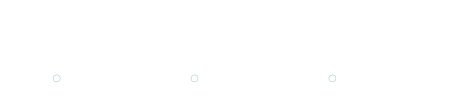

<h1>Hello, I'm Daniel, 
<a href="https://www.linkedin.com/in/danielfeiteirasilva/">Hardware / Electronics Design Engineer</a>
</h1>

<a href="https://www.linkedin.com/in/danielfeiteirasilva/"><b>LinkedIn</b></a>
&nbsp;•&nbsp;
<a href="https://drive.google.com/file/d/1MHCeoKyA92jdbroBhyvaDAcD4FCaMBN4/view?usp=sharing"><b>Resume / CV</b></a>
&nbsp;•&nbsp;
<a href="mailto:danielsilvacs@gmail.com"><b>Email</b></a>

<!-------------------------------- Professional Profile -------------------------------->

<h2>Professional Profile</h2>

Electronics and Hardware Design Engineer with <b>5 years of hands-on experience in electronics and PCB design</b>.
Experienced in <b>schematic capture, PCB layout, embedded hardware, prototyping, testing, and hardware-software co-design</b>,
with professional experience in <b>E-Mobility, communication systems, and R&D</b>.

<h2>💼 Professional Experience</h2>

  

<!-------------------------------- Selected Hardware & PCB Projects -------------------------------->

<h2>🔧 Selected Hardware & PCB Projects</h2>

<h3>Featured Projects</h3>

<ul>

  <li>
    <b>Low-Power RTK Positioning Base Station</b>
     
    Master's thesis project developed in collaboration with Beyond Vision, involving electronic design, PCB development, prototyping, and RTK positioning.
     
    <a href="https://github.com/danielftsilva/RTK-Base-Station">View Project →</a>
  </li>

   
  
  <li>
    <b>Smart Home Environmental Controller</b>
     
    Embedded controller for environmental monitoring and home automation, combining sensors, user interfaces, and low-voltage control outputs.
     
    <a href="https://github.com/danielftsilva/Smart-Home-Environmental-Controller">View Project →</a>
  </li>

   

  <li>
    <b>STM32 USB-to-2.4 GHz RF Gateway</b>
     
    Embedded wireless communication platform featuring STM32, nRF24L01P, USB connectivity, and a dedicated 50 Ω RF interface.
     
    <a href="https://github.com/danielftsilva/STM32-Industrial-Sensor-Controller">View Project →</a>
  </li>

   

  <li>
    <b>USB-to-Ethernet Embedded Gateway</b>
     
    Embedded networking platform combining USB, 100BASE-T Ethernet, high-speed differential routing, and hardware-software integration.
     
    <a href="https://github.com/danielftsilva/USB-Ethernet-Embedded-Controller">View Project →</a>
  </li>

   

  <li>
    <b>24 V Industrial Power Management Board</b>
     
    Power electronics platform for converting and distributing a 24 V DC input to regulated low-voltage rails, with protection, monitoring, and power characterization.
     
    <a href="https://github.com/danielftsilva/Synchronous-Buck-Power-Board">View Project →</a>
  </li>

   

</ul>

<b>→ <a href="https://github.com/danielftsilva?tab=repositories">View all projects</a></b>

<!-------------------------------- Embedded Systems -------------------------------->

<h2>🤖 Embedded Systems</h2>

<ul>
  <li>
    <b>Bluetooth-Enabled Analog Alarm Clock</b>
     
    Embedded project integrating Bluetooth communication with an analog clock interface.
     
    <a href="https://github.com/danielftsilva/HC-05-Analog-Clock">View Project →</a>
  </li>

   

  <li>
    <b>Smart Home Automation System</b>
     
    Home automation project exploring device integration, control logic, and networked embedded systems.
     
    <a href="https://github.com/danielftsilva/Smart-Home-Automation-System">View Project →</a>
  </li>

   

  <li>
    <b>Raspberry Pi NAS & VPN Server</b>
     
    Raspberry Pi-based embedded Linux project combining network storage, VPN services, and system administration.
     
    <a href="https://github.com/danielftsilva/RPi-NAS-VPN">View Project →</a>
  </li>
</ul>

<h3>Professional Development</h3>

<ul>
  <li><b>Embedded Systems Bare-Metal Programming Ground Up™</b> - STM32</li>
  <li><b>FreeRTOS From Ground Up™ on ARM Processors</b> - Revised</li>
</ul>

<!-------------------------------- Analog Electronics & Audio -------------------------------->

<h2>🎸 Analog Electronics & Audio</h2>

<ul>
  <li>
    <b>TS-808 Guitar Pedal Replica</b>
     
    Analog electronics and PCB design project involving schematic analysis, circuit replication, PCB layout, prototyping, and testing.
     
    <a href="https://github.com/danielftsilva/TS-808-Replica">View Project →</a>
  </li>

   

  <li>
    <b>Texas Square Face Fuzz Guitar Pedal Replica</b>
     
    Analog fuzz circuit replication project focused on schematic analysis, PCB design, component selection, and prototyping.
     
    <a href="https://github.com/danielftsilva/TX-SQFF-Replica">View Project →</a>
  </li>

   

  <li>
    <b>"Japanese" Fuzz Face Guitar Pedal</b>
     
    Analog audio project exploring fuzz circuit design, PCB layout, component selection, and hardware implementation.
     
    <a href="https://github.com/danielftsilva/JP-Fuzz-Face">View Project →</a>
  </li>

   

  <li>
    <b>MXR M-144 Loop Selector Replica</b>
     
    Audio switching and routing project involving analog signal paths, PCB design, switching circuitry, and hardware prototyping.
     
    <a href="https://github.com/danielftsilva/M-144-Replica">View Project →</a>
  </li>
</ul>

<!-------------------------------- Software & Automation -------------------------------->

<h2>💻 Software & Automation</h2>

<ul>
  <li>
    <b>Real-Time Lane & Vehicle Detection</b>
     
    Computer vision project using OpenCV and OpenCL for real-time image processing and hardware-accelerated computation.
     
    <a href="https://github.com/danielftsilva/RT-Lane-Vehicle-Detection">View Project →</a>
  </li>

   

  <li>
    <b>Python Stock Market Analysis</b>
     
    Python-based data analysis project exploring data processing, visualization, and quantitative analysis.
     
    <a href="https://github.com/danielftsilva/Stock-Market-Py-Analysis">View Project →</a>
  </li>

</ul>

<!-------------------------------- Technical Skills -------------------------------->

<h2>🛠️ Technical Skills</h2>

<h3>Hardware & PCB Design</h3>

&nbsp;

&nbsp;
<a href="https://www.analog.com/en/resources/design-tools-and-calculators/ltspice-simulator.html" target="_blank" rel="noreferrer">
  

<b>Schematic Capture</b> · <b>PCB Layout</b> · <b>High-Speed Design</b> · <b>Signal Integrity</b> · <b>Power Integrity</b> · <b>Thermal Management</b> · <b>Hardware Debugging</b> · <b>Prototyping</b>

<h3>Embedded Systems</h3>

&nbsp;

&nbsp;

&nbsp;

<b>STM32</b> · <b>ESP32</b> · <b>Arduino</b> · <b>Raspberry Pi</b> · <b>Bare-Metal Programming</b> · <b>RTOS</b> · <b>Peripheral Drivers</b> · <b>I²C</b> · <b>SPI</b> · <b>UART</b> · <b>GPIO</b>

<h3>Programming & Automation</h3>

&nbsp;

&nbsp;

&nbsp;

&nbsp;

&nbsp;

<b>Python</b> · <b>C</b> · <b>C++</b> · <b>C#</b> · <b>TeX</b> · <b>HTML</b> · <b>CSS</b> · <b>Cypress</b> · <b>Electron</b> · <b>Svelte</b> · <b>Git</b> · <b>Linux</b>

<h3>Engineering & Development Tools</h3>

&nbsp;

&nbsp;

&nbsp;

<b>MATLAB</b> · <b>Jira</b> · <b>Notion</b> · <b>LaTeX</b>

<!-------------------------------- Contact -------------------------------->

<h2>📫 Contact</h2>

&nbsp;
<a href="https://www.linkedin.com/in/danielfeiteirasilva/">linkedin.com/in/danielfeiteirasilva</a>

📧
&nbsp;
<a href="mailto:danielsilvacs@gmail.com">danielsilvacs@gmail.com</a>

📄
&nbsp;
<a href="https://drive.google.com/file/d/1MHCeoKyA92jdbroBhyvaDAcD4FCaMBN4/view?usp=sharing">View my Resume</a>

